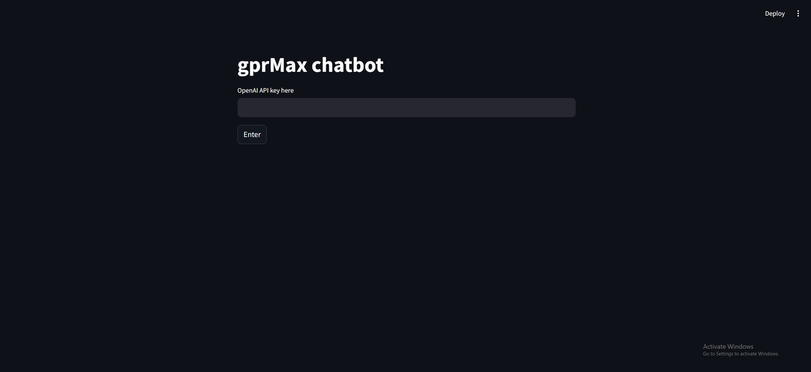

# Google Summer of Code 2024


### Project: [AI Chatbot and Assistant for Support](https://summerofcode.withgoogle.com/programs/2024/projects/DwjJyBl7)

This project aims to improve the user experience of gprMax, an open-source software for simulating electromagnetic wave propagation by modelling Ground Penetrating Radar (GPR) and electromagnetic wave propagation, through the development of an AI chatbot and assistant. The purpose of the AI chatbot is to answer and troubleshoot any questions that the gprMax users may have, while the AI assistant is capable of turning natural language into an input file in the required gprMax format. We will leverage existing pretrained LLM models and the LangChain framework, and fine-tune the LLMs using LoRA and RAG techniques, drawing on the existing gprMax documentation and years worth of discussion in the Google groups and the GitHub issue tracker for data. The ultimate goal is to deliver and deploy an AI chatbot and assistant to enhance the accessibility of gprMax, as well as save both the users and the development team valuable time by automating the troubleshooting process.

#### Organisation: [gprMax](https://summerofcode.withgoogle.com/programs/2024/organizations/gprmax)

#### Contributor: Jung Whan Lee (eddieleejw)


 [For more details on the development of the chatbot, refer to my **TextGPT** repository developed alongside this chatbot, where you can:](https://github.com/eddieleejw/textgpt)
 - Create chatbots based on any custom set of documents
 - Evaluate a chatbot's performance to select the best chatbot for your needs
 - Finetune base chat models (e.g. to use as your LLM layer)
 - Query your chatbots

# How does it work?

### LLM

### RAG


# Installation

1. Install [Docker](https://www.docker.com/) 
    - Confirm docker installation by opening terminal and typing `docker -v`. It should tell you your docker version
2. Open terminal and navigate to the directory you want to put the repo in
3. Make sure Docker is running
4. In the terminal type:
```
git clone https://github.com/eddieleejw/gprmax_chatbot.git
cd gprmax_chatbot
docker build -t gprmax-image .
```

Building the image may take a few minutes.


# Usage

## Launch

1. Open terminal and type `docker run -p 8501:8501 gprmax-image`
2. In a web browser, type into the address bar: `http://localhost:8501` (not `http://0.0.0.0:8501`)


## OpenAI API Key

You will need a valid OpenAI API key to use this chatbot

1. Sign up for an [OpenAI account](https://openai.com/index/openai-api/)

2. Navigate to the [API keys page](https://platform.openai.com/api-keys)

3. Select "+ Create new secret key", give it a name, and select "Create secret key"

The chatbot will ask you for your OpenAI API key on launch in order to access the OpenAI language models.




## Chatting

1. Select chat model from the drop down menu on the left
    - We recommend "gpt-4o-mini" for most queries, as it is the cheapest option while still being very powerful
    - "gpt-4o" is more powerful, but will cost more per use

2. Enter your query in the chat box

3. Click the "See sources" drop down to see the documents referred to by the chatbot


# Examples

### Example 1


### Example 2


